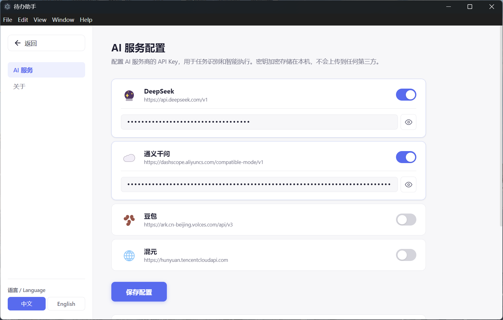
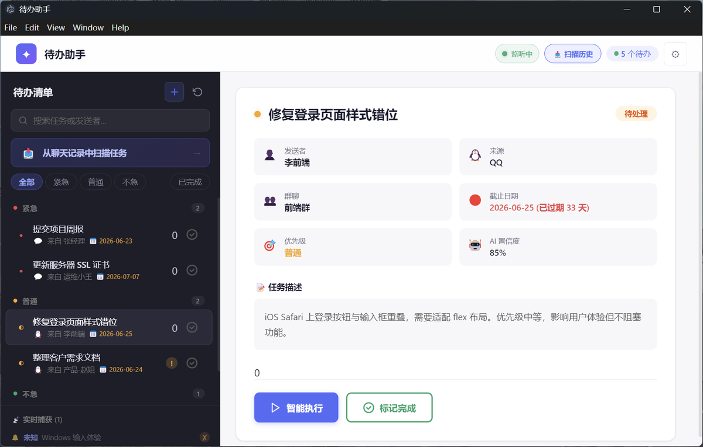
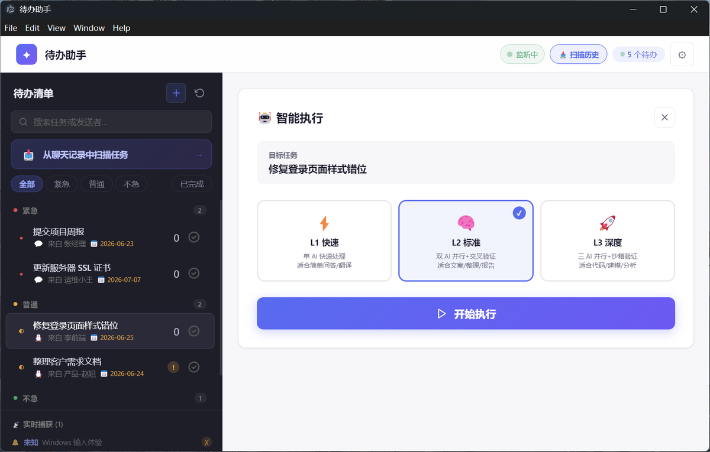

# 待办助手

Windows 桌面任务助手。开着微信/QQ 聊天的时候，自动帮你抓取聊天里提到的事情，识别是不是任务，提取出来存到待办列表里。

## 这是什么

上班的时候微信、QQ 里经常会收到各种任务——"帮我查一下这个数据""下午三点前把报告发我""明天记得找张总确认"。消息一多就忘了。

这个工具在后台监听聊天消息（通过 Windows UI Automation），用 AI 判断是不是在给你派任务，自动提取标题、优先级、截止时间，帮你记下来。

内置了智能执行功能，能自动写代码、生成报告文件、分析数据——把任务从"识别"到"执行"一条龙处理。

## 截图

截几张图放在 `screenshots/` 目录下，取消下面注释就行。

<!--



-->

## 能做什么

- 监听微信/QQ 消息和通知弹窗，自动识别是不是有人在给你派任务
- 提取关键信息：标题、优先级、截止时间
- 支持回溯历史聊天记录（OCR 识别，最长 7 天）
- 任务可以手动新增、编辑、标记完成
- 智能执行模式：多 AI 并行推理，能出代码、写报告、生成文件
- 支持 DeepSeek、通义千问、豆包、混元
- 中英文界面

## 怎么跑起来

### 装环境

需要 Node.js（>=18）和 Python（>=3.11），Windows 上直接用 winget：

```
winget install OpenJS.NodeJS.LTS
winget install Python.Python.3.12
```

历史扫描的 OCR 功能需要 Tesseract（不装也能用，OCR 相关功能会自动跳过）：

```
winget install UB-Mannheim.TesseractOCR
pip install easyocr pyperclip pillow pytesseract
```

### 启动

```bash
git clone https://github.com/JMS852/待办助手.git
cd task-assistant
npm install
pip install -r requirements.txt
npm run dev
```

或者直接双击 `launch.vbs`，不用开命令行。

### 配 AI Key

打开设置页面填入 API Key。Key 存在本地 SQLite 里，不会发到任何服务器。

- DeepSeek: [platform.deepseek.com](https://platform.deepseek.com)
- 通义千问: [dashscope.aliyun.com](https://dashscope.aliyun.com)
- 豆包: [console.volcengine.com](https://console.volcengine.com)
- 混元: [console.cloud.tencent.com](https://console.cloud.tencent.com)

## 怎么工作的

```
微信/QQ ──UIA监听──► Python ──AI识别──► 待办列表 ──► React 界面
                         │
                         └── 提取标题/优先级/截止时间
                         └── 智能执行（可选）
```

三个进程通信：

- **Electron ↔ Python**: 起一个 Python 子进程，stdin/stdout 传 JSON，一行一个消息
- **Electron ↔ React**: IPC（contextBridge）+ 本地 HTTP API（端口 3001）
- **Python ↔ AI**: HTTP 调 OpenAI 兼容接口

## 目录结构

```
electron/     Electron 主进程（窗口、托盘、IPC、DB）
src/          React 前端（组件、hooks、多语言）
python/       Python 后端
  collector/  消息采集（UIA 监听、通知弹窗检测、历史扫描）
  engine/     任务识别 + 信息提取
  smart/      AI 编排、沙箱执行、模型路由
test/         测试
```

## 构建

```bash
npm run build    # 出安装包，在 release/ 目录
```

## 测试

```bash
python -m pytest test/python/ -v
npx tsc -p tsconfig.json --noEmit
```

## License

MIT
