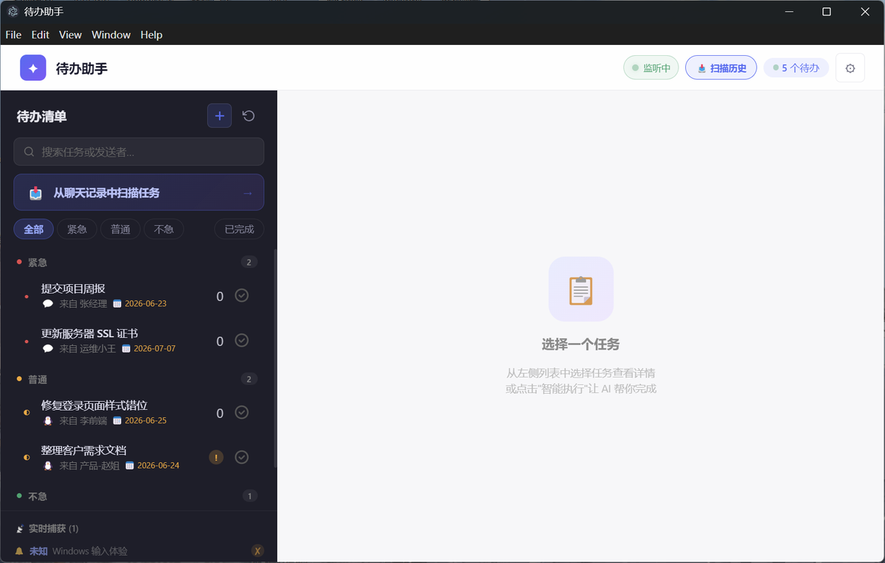

# 待办助手 (Task Assistant)

<p align="center">
  
  
  
  
  
</p>

<p align="center">
  <b>Windows 桌面待办助手</b> — 自动监听微信/QQ 消息，AI 识别并提取任务，智能执行。<br>
  🖥️ Electron + React + Python 混合架构
</p>

---

## ✨ 功能亮点

| 功能 | 说明 |
|------|------|
| 🔍 **实时消息监听** | UI Automation + Win32 API 自动捕获微信/QQ 聊天消息和通知弹窗 |
| 🧠 **AI 任务识别** | 启发式规则 + 大模型双引擎，权重融合判断任务意图 |
| 📋 **智能提取** | 自动提取任务标题、优先级（高/中/低）、截止时间 |
| 🚀 **智能执行 L1-L3** | 多 AI 并行推理 → 交叉验证 → 沙箱执行 → 综合输出 |
| 📥 **历史扫描** | 回溯 7 天聊天记录，OCR + 剪贴板双通路读取 |
| 🌐 **双语界面** | 中文 / English 完整国际化 |
| 🔌 **多模型支持** | DeepSeek / 通义千问 / 豆包 / 混元，设置页一键切换 |

---

## 🎬 截图

> 💡 使用中截图待补充 — 将图片放入 `screenshots/` 目录后在下方取消注释

<!--
| 任务列表 | 智能执行 |
|---------|---------|
|  |  |

| 历史扫描 | 设置页面 |
|---------|---------|
|  |  |
-->

---

## 📋 前置依赖

| 依赖 | 版本 | 用途 | 安装 |
|------|------|------|------|
| **Node.js** | >=18 | Electron + React 前端 | `winget install OpenJS.NodeJS.LTS` |
| **Python** | >=3.11 | AI 识别 / 消息监听 | `winget install Python.Python.3.12` |
| **Tesseract OCR** | 可选 | 历史扫描 OCR | `winget install UB-Mannheim.TesseractOCR` |

可选增强（历史扫描）：
```bash
pip install easyocr pyperclip pillow pytesseract
```

---

## 🚀 快速开始

```bash
# 1. 克隆仓库
git clone https://github.com/JMS852/task-assistant.git
cd task-assistant

# 2. 安装 Node.js 依赖
npm install

# 3. 安装 Python 依赖
pip install -r requirements.txt

# 4. 启动开发模式
npm run dev

# Windows 桌面快捷方式
# 双击 launch.vbs 一键启动
```

---

## ⚙️ 配置 AI 服务

1. 启动应用，点击 ⚙ 进入设置
2. 填入对应 AI 服务的 API Key：

| 服务 | 获取地址 |
|------|----------|
| 🔮 **DeepSeek** | [platform.deepseek.com](https://platform.deepseek.com) |
| ☁️ **通义千问** | [dashscope.aliyun.com](https://dashscope.aliyun.com) |
| 🫘 **豆包** | [console.volcengine.com](https://console.volcengine.com) |
| 💧 **混元** | [console.cloud.tencent.com](https://console.cloud.tencent.com) |

> 🔒 API Key 仅存储在本地 SQLite 数据库，不上传任何远程服务器。

---

## 🏗️ 架构

```
task-assistant/
├── electron/                  # Electron 主进程
│   ├── main.ts                # 窗口管理 + IPC 路由
│   ├── preload.ts             # contextBridge 安全暴露
│   ├── types.ts               # 共享 TypeScript 接口
│   ├── services/
│   │   ├── db.ts              # SQL.js 本地数据库
│   │   └── python-bridge.ts   # Python 子进程 + JSON 协议
│   └── api/
│       └── routes/tasks.ts    # REST API (端口 3001)
├── src/                       # React 渲染进程
│   ├── components/            # UI 组件（15+）
│   ├── hooks/                 # React hooks + API 封装
│   ├── i18n/                  # 中英文国际化
│   └── types/                 # 前端类型定义
├── python/                    # Python 后端
│   ├── collector/             # 消息采集层
│   │   ├── uia_listener.py    # UI Automation 实时监听
│   │   ├── toast_detector.py  # Win32 通知弹窗检测
│   │   └── chat_history_scanner.py  # 聊天记录扫描
│   ├── engine/                # 识别引擎
│   │   ├── recognizer.py      # 启发式 + AI 双引擎识别
│   │   └── extractor.py       # 任务信息结构化提取
│   ├── smart/                 # 智能执行层
│   │   ├── orchestrator.py    # 主编排器（分析→分解→执行→验证→综合）
│   │   ├── sandbox.py         # Docker/本地沙箱安全执行
│   │   ├── ai_router.py       # 多模型路由分发
│   │   └── validator.py       # 交叉验证
│   └── main.py                # stdin/stdout JSON 事件循环
└── test/                      # 测试
```

### 进程间通信

```
┌──────────┐  IPC/contextBridge   ┌──────────┐  spawn/stdin-stdout   ┌──────────┐
│  React   │ ◄──────────────────► │ Electron │ ◄───────────────────► │  Python  │
│  前端    │    REST (port 3001)   │  主进程   │    JSON Lines 协议     │  后端    │
└──────────┘                      └──────────┘                       └────┬─────┘
                                                                         │
                                                                   HTTP OpenAI API
                                                                         │
                                                                   ┌─────┴─────┐
                                                                   │ DeepSeek  │
                                                                   │ 通义千问   │
                                                                   │ 豆包/混元  │
                                                                   └───────────┘
```

---

## 🛠️ 技术栈

| 层 | 技术 | 说明 |
|----|------|------|
| 🖥️ 桌面框架 | Electron 28+ | 系统托盘、开机自启、Windows 原生通知 |
| 🎨 前端 | React 18 + TypeScript | Hooks 架构、CSS Modules、Fluent Design 风格 |
| 🐍 后端 | Python 3.12 | UI Automation、OCR、AI 编排 |
| 🗄️ 数据库 | SQL.js | 纯前端 SQLite，零配置 |
| 🔗 通信协议 | JSON Lines | Python ↔ Electron stdin/stdout 双向通信 |
| 🧪 测试 | Pytest | Python 单元测试 |

---

## 🛠️ 构建

```bash
npm run build          # 构建安装包到 release/
npm run build:dir      # 仅打包目录（调试用）
```

---

## 🧪 测试

```bash
python -m pytest test/python/ -v     # Python 测试
npx tsc -p tsconfig.json --noEmit    # TypeScript 类型检查
```

---

## 📄 许可

MIT License — 详见 [LICENSE](LICENSE)
